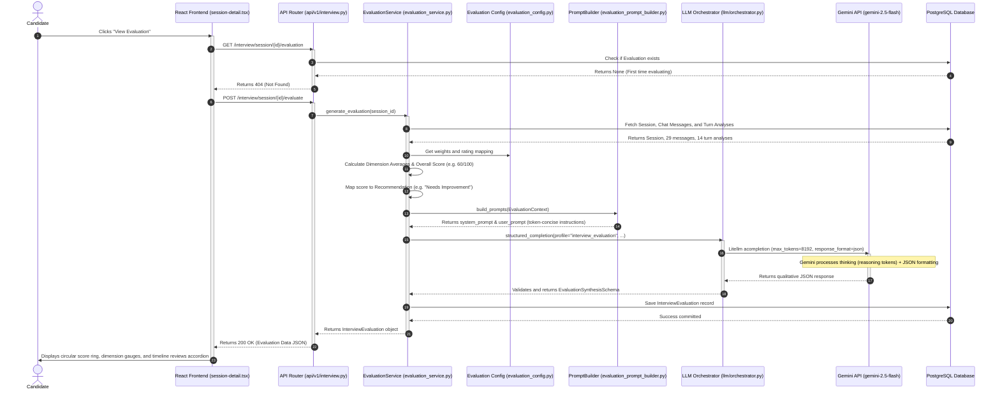

# NextRound Evaluation Engine Guide

This document provides a comprehensive developer guide detailing the end-to-end technical execution flow of the **NextRound Evaluation Engine**. It traces the execution chronologically from the moment a user clicks **"View Evaluation"** on the frontend, down to the deterministic backend calculations, Gemini API synthesis, database persistence, and final frontend rendering.

---

## Technical Architecture Overview

The following diagram illustrates the complete sequence of events across the frontend, API router, evaluation service, LLM orchestrator, and database.



---

## Detailed Step-by-Step Execution Flow

---

### Step 1: The User Triggers the Request (React Frontend)
* **Responsible File**: [`artifacts/nextround/src/pages/session-detail.tsx`](file:///Users/apple/Downloads/Interview-Orchestrator/artifacts/nextround/src/pages/session-detail.tsx)

When the user enters the page, React hooks check if an evaluation has already been generated. If it gets a `404` error (indicating first-time load), it triggers a `POST` request to generate it:

```typescript
// From session-detail.tsx: React hooks loading logic
try {
  const res = await apiFetch(`/interview/session/${id}/evaluation`)
  evalData = await res.json()
} catch (e: any) {
  if (e.status === 404) {
    setGenerationStatus("Synthesizing evaluation report (this may take up to 30 seconds)...")
    const generateRes = await apiFetch(`/interview/session/${id}/evaluate`, {
      method: "POST"
    })
    evalData = await generateRes.json()
  } else {
    throw e
  }
}
```

---

### Step 2: Route Dispatch & Idempotency Check (API Layer)
* **Responsible File**: [`backend/app/api/v1/interview.py`](file:///Users/apple/Downloads/Interview-Orchestrator/backend/app/api/v1/interview.py)

The FastAPI routing layer handles the authentication and dispatches to the `EvaluationService`. If the record already exists, it immediately returns the cached database record, preventing redundant LLM calls:

```python
# From app/api/v1/interview.py: Evaluate endpoint route
@router.post(
    "/session/{session_id}/evaluate",
    response_model=InterviewEvaluationResponseSchema,
    status_code=status.HTTP_200_OK,
)
async def evaluate_session(
    session_id: uuid.UUID,
    db: AsyncSession = Depends(get_db),
    current_user: User = Depends(get_current_active_user),
):
    service = EvaluationService(db)
    evaluation = await service.generate_evaluation(session_id)
    return evaluation
```

---

### Step 3: Fetching Session History (Service Layer)
* **Responsible File**: [`backend/app/services/interview/evaluation_service.py`](file:///Users/apple/Downloads/Interview-Orchestrator/backend/app/services/interview/evaluation_service.py)

To evaluate an interview, we must collect all conversation history (`InterviewMessage`) and the granular turn-by-turn evaluations (`InterviewTurnAnalysis`) that were generated in real-time as the candidate answered each question:

```python
# From app/services/interview/evaluation_service.py: DB fetch query
# Fetch session, messages, and turn analyses
session = await self.db.scalar(
    select(InterviewSession).filter(InterviewSession.id == session_id)
)
history = list((await self.db.scalars(
    select(InterviewMessage)
    .filter(InterviewMessage.session_id == session_id)
    .order_by(InterviewMessage.sequence_number.asc())
)).all())
analyses = list((await self.db.scalars(
    select(InterviewTurnAnalysis)
    .join(InterviewMessage)
    .filter(InterviewMessage.session_id == session_id)
)).all())
```

---

### Step 4: Deterministic Score Calculation (Service Layer)
* **Responsible Files**: 
  - [`backend/app/services/interview/evaluation_service.py`](file:///Users/apple/Downloads/Interview-Orchestrator/backend/app/services/interview/evaluation_service.py)
  - [`backend/app/services/interview/evaluation_config.py`](file:///Users/apple/Downloads/Interview-Orchestrator/backend/app/services/interview/evaluation_config.py)

To maintain consistency and block LLM hallucination of scores, all star ratings and overall numbers are computed **deterministically** by the backend based on dynamic configurations matching the interview's category:

```python
# From app/services/interview/evaluation_service.py: Mathematical Scoring Engine
# 1. Map text metrics (EXCELLENT, GOOD, FAIR, POOR) to numbers (100, 85, 65, 40)
# 2. Average the dimensions according to weighting configuration
dimension_totals = {d: 0.0 for d in weights.keys()}
dimension_counts = {d: 0 for d in weights.keys()}

for turn in candidate_turns:
    msg_id_str = str(turn.id)
    if msg_id_str in analyses_by_msg:
        a = analyses_by_msg[msg_id_str]
        for dimension in weights.keys():
            val = getattr(a, dimension, "N/A")
            if val != "N/A" and val in QUALITY_SCORE_MAPPING:
                dimension_totals[dimension] += QUALITY_SCORE_MAPPING[val]
                dimension_counts[dimension] += 1

dimension_averages = {}
for d in weights.keys():
    count = dimension_counts[d]
    dimension_averages[d] = dimension_totals[d] / count if count > 0 else 70.0

# 3. Calculate Overall Weighted Score
overall_score_float = sum(dimension_averages[d] * w for d, w in weights.items())
overall_score = min(max(0, int(round(overall_score_float))), 100)

# 4. Map overall score to Hire/No Hire thresholds
recommendation = "Borderline Hire"
for item in RECOMMENDATION_THRESHOLDS:
    if item["min"] <= overall_score <= item["max"]:
        recommendation = item["recommendation"]
        break
```

The dynamic configuration mappings are defined in `evaluation_config.py`:
```python
# From app/services/interview/evaluation_config.py: Dynamic Weights & Categories
EVALUATION_WEIGHTS = {
    "TECHNICAL": {
        "technical_accuracy": 0.40,
        "depth": 0.25,
        "coverage": 0.15,
        "communication": 0.10,
        "confidence": 0.10,
    },
    ...
}

QUALITY_SCORE_MAPPING = {
    "EXCELLENT": 100.0,
    "GOOD": 85.0,
    "FAIR": 65.0,
    "POOR": 40.0,
}
```

---

### Step 5: Prompt Construction (Prompt Layer)
* **Responsible Files**:
  - [`backend/app/services/interview/evaluation_context.py`](file:///Users/apple/Downloads/Interview-Orchestrator/backend/app/services/interview/evaluation_context.py)
  - [`backend/app/services/interview/evaluation_prompt_builder.py`](file:///Users/apple/Downloads/Interview-Orchestrator/backend/app/services/interview/evaluation_prompt_builder.py)

The service maps the records into a type-safe `EvaluationContext` containing the transcript and real-time metric evaluations. The `EvaluationPromptBuilder` compiles this context into clean prompts. 

To prevent LLM token overflow (caused by Gemini's internal reasoning tokens using up context limits), **strict conciseness instructions and filters** are built into the prompt:

```python
# From app/services/interview/evaluation_prompt_builder.py: Conciseness Prompt
SYSTEM_INSTRUCTIONS = """You are a senior technical and behavioral interview evaluator for NextRound.
Your task is to analyze the candidate's complete mock interview session and synthesize qualitative feedback.

CRITICAL INSTRUCTIONS:
1. The backend has already computed the final overall score and recommendation deterministically. You MUST accept these values as absolute truth.
   - Deterministic Overall Score: {overall_score}/100
   - Deterministic Recommendation: {recommendation}
2. Your primary job is to write a cohesive, professional `summary` justifying the backend-calculated performance. Do NOT include generic congratulations (3-4 sentences maximum).
3. In the "timeline_reviews" list, you MUST generate reviews ONLY for actual technical questions asked by the interviewer (types: PRIMARY, FOLLOW_UP, CLARIFICATION). Do NOT generate review items for greetings, warm-up/introductions, or closing remarks.
4. For each technical question review, you MUST be extremely concise:
   - Provide a highly brief `ideal_answer` (2 sentences maximum).
   - Evaluate the candidate's actual reply against the ideal answer (`evaluation`), keeping it brief (1-2 sentences maximum).
   - List the candidate's concrete `strengths` (maximum 2 items, very short).
   - List specific areas for `improvements` (maximum 2 items, very short).
5. Output your response strictly as a valid JSON object matching the requested schema.
"""
```

---

### Step 6: Token-Safe LLM Synthesis (LLM Orchestration Layer)
* **Responsible Files**:
  - [`backend/app/llm/orchestrator.py`](file:///Users/apple/Downloads/Interview-Orchestrator/backend/app/llm/orchestrator.py)
  - [`backend/app/llm/providers/gemini.py`](file:///Users/apple/Downloads/Interview-Orchestrator/backend/app/llm/providers/gemini.py)
  - [`backend/configs/llm_profiles.yaml`](file:///Users/apple/Downloads/Interview-Orchestrator/backend/configs/llm_profiles.yaml)

The orchestrator reads settings from `llm_profiles.yaml` (which configures `max_tokens: 8192` for the `gemini-flash` profile to prevent truncation) and invokes `GeminiProvider`:

```python
# From app/llm/providers/gemini.py: API Call Execution
response = await litellm.acompletion(
    model=target_model,
    messages=[
        {"role": "system", "content": system_prompt},
        {"role": "user", "content": user_prompt},
    ],
    temperature=target_temp,
    max_tokens=target_tokens,   # Resolves to 8192
    timeout=target_timeout,
    response_format={"type": "json_object"},
)
```

If the JSON decoding fails, the provider logs the raw string response to simplify debugging:
```python
try:
    data = json.loads(content)
except json.JSONDecodeError as e:
    logger.error("Failed to decode LLM JSON response", error=str(e), raw_content=content)
    raise
```

---

### Step 7: Database Persistence (Persistence Layer)
* **Responsible Files**:
  - [`backend/app/models/interview/interview_evaluation.py`](file:///Users/apple/Downloads/Interview-Orchestrator/backend/app/models/interview/interview_evaluation.py)
  - [`backend/app/services/interview/evaluation_service.py`](file:///Users/apple/Downloads/Interview-Orchestrator/backend/app/services/interview/evaluation_service.py)

Once Gemini returns the structured completion schema, the service instantiates the database model and saves it to PostgreSQL, locking in the cached evaluation record for all future requests:

```python
# From app/services/interview/evaluation_service.py: DB Persistence
evaluation = InterviewEvaluation(
    session_id=session_id,
    overall_score=overall_score,
    recommendation=recommendation,
    summary=synthesis_result.summary,
    timeline_reviews=timeline_data,
    skill_scores=skill_scores,
    evaluation_version="v1",
)
self.db.add(evaluation)
await self.db.commit()
await self.db.refresh(evaluation)
return evaluation
```

---

### Step 8: Frontend Rendering & Visual Presentation
* **Responsible File**: [`artifacts/nextround/src/pages/session-detail.tsx`](file:///Users/apple/Downloads/Interview-Orchestrator/artifacts/nextround/src/pages/session-detail.tsx)

After the `POST` request returns successfully, the state variables are updated and the browser renders:
1. **Centered Radial Score Indicator**: A balanced SVG ring matching your rating out of 100.
2. **Dynamic Skill Progress Gauges**: Bars scaling your weighted scores into star rating averages.
3. **Timeline Review Cards**: Collapsible accordions outlining the questions, answers, references, and critique bullets.

```typescript
// From session-detail.tsx: Dynamic rating progress UI
{Object.entries(evaluation.skill_scores).map(([name, score]) => (
  <div key={name} className="space-y-2">
    <div className="flex justify-between text-sm">
      <span className="font-medium text-muted-foreground">{name}</span>
      <div className="flex items-center gap-1">
        <Star className="w-3.5 h-3.5 fill-[#FBBC05] text-[#FBBC05]" />
        <span className="font-bold text-foreground">{score.toFixed(1)}</span>
      </div>
    </div>
    <Progress value={score * 20} className="h-1.5" />
  </div>
))}
```
