# NextRound: AI Mock Interview Orchestrator Guide (Deep Dive)

This document is a comprehensive guide to NextRound's AI Mock Interview system. It outlines the codebase layout, data models, state management, adaptive logic, prompt templates, implementation algorithms, and the automated testing structure.

---

## 1. Complete End-to-End Interview Lifecycle Flowchart

The following diagram traces the complete execution lifecycle from uploading a resume to interview completion, specifying which backend code files execute each component:

```mermaid
flowchart TD
    %% Define Styles %%
    classDef startEnd fill:#1A1F2C,stroke:#0A9396,stroke-width:2px,color:#fff;
    classDef process fill:#1A1F2C,stroke:#94D2BD,stroke-width:1px,color:#fff;
    classDef db fill:#1A1F2C,stroke:#EE9B00,stroke-width:1.5px,color:#fff;
    classDef decision fill:#1A1F2C,stroke:#CA6702,stroke-width:2px,color:#fff;

    %% Nodes %%
    A([Start: Upload Resume<br/>api/v1/resume.py]):::startEnd
    B[Extract Text & Parse Resume JSON<br/>extraction_service.py / parser_service.py]:::process
    C[(Save Candidate Profile<br/>models/resume.py / db)]:::db
    D[Confirm Profile Details<br/>api/v1/resume.py & confirmation_service.py]:::process
    E[Initialize Interview Session<br/>session_service.py]:::process
    F[(Create Session Record<br/>models/interview/interview_session.py)]:::db
    
    G[Generate Section Blueprint via LLM<br/>blueprint_service.py]:::process
    H[(Save Session Blueprint<br/>models/interview/interview_blueprint.py)]:::db
    I[Start Turn 1: Greeting state<br/>interview_engine.py & prompt_builder.py]:::process
    J[Candidate Sends Message Reply<br/>api/v1/interview.py]:::process
    
    K[Calculate Active & Section Time<br/>interview_engine.py - _calculate_active_time]:::process
    L[Analyze Turn Observations<br/>interviewer_agent.py & LLM APIs]:::process
    M[(Save Turn Analysis Observations<br/>models/interview/interview_turn_analysis.py)]:::db
    
    N{Session Active Time >= Limit?<br/>interview_decision_engine.py}:::decision
    O[Set State Override = CLOSING<br/>interview_decision_engine.py]:::process
    
    P{Evaluate Gating Rules<br/>interview_decision_engine.py}:::decision
    Q[Action: SECTION_COMPLETE<br/>interview_decision_engine.py]:::process
    R[Advance Section Index<br/>state_machine.py]:::process
    
    S{Adaptive Difficulty Shift?<br/>interview_decision_engine.py}:::decision
    T[Increase Difficulty EASY -> MED -> HARD<br/>interview_decision_engine.py]:::process
    U[Decrease Difficulty HARD -> MED -> EASY<br/>interview_decision_engine.py]:::process
    
    V[Compile System Prompt Context<br/>prompt_builder.py - Rules 1-16]:::process
    W[Invoke LLM Response Generation<br/>interviewer_agent.py & llm/orchestrator.py]:::process
    X[Scrub Praise Prefix via Regex<br/>interview_engine.py - clean_interviewer_message]:::process
    Y[(Save Interviewer Message<br/>conversation_service.py & models/interview/interview_message.py)]:::db
    Z[Respond with Clean Message to Client<br/>api/v1/interview.py]:::process
    
    AA{State is CLOSING?<br/>state_machine.py}:::decision
    AB[Request Self-Rating Outro Question<br/>prompt_builder.py]:::process
    AC([End: State COMPLETED]):::startEnd

    %% Relationships %%
    A --> B
    B --> C
    C --> D
    D --> E
    E --> F
    F --> G
    G --> H
    H --> I
    I --> J
    J --> K
    K --> L
    L --> M
    M --> N
    
    %% Timeout override logic
    N -- Yes --> O
    O --> V
    N -- No --> P
    
    %% Gating logic
    P -- Scaled Time Limit / Max Qs Reached --> Q
    Q --> R
    R --> S
    P -- In-progress Question / Followup --> S
    
    %% Difficulty shifts
    S -- Both Accuracy & Depth EXCELLENT --> T
    S -- Accuracy POOR --> U
    S -- Score Average --> V
    T --> V
    U --> V
    
    %% Response execution
    V --> W
    W --> X
    X --> Y
    Y --> Z
    Z --> AA
    
    %% Closing check
    AA -- Yes --> AB
    AB --> AC
    AA -- No --> J
```



### Component Details in the Flowchart:
*   **Resume Extraction & Parsing**: Receives raw file uploads, extracts plain text via OCR libraries, and feeds it to Gemini using structured outputs schema definitions, converting CVs into structured profiles.
*   **Blueprint Generation**: Sets up sections dynamically tailored to the candidate's resume (e.g. Project deep-dive, coding topics). It outputs min/max question constraints and section target times.
*   **Capped Active Time Tracking**: Deducts process turn latency from conversation timers and applies a **120-second threshold** cap per turn to mitigate candidate AFK gaps.
*   **InterviewDecisionEngine**: Core coordinator evaluating section time gates (scaled proportionally), maximum followup thresholds, clarification requests, and session timeouts.
*   **Adaptive Difficulty Adjustments**: Gradually steps difficulty boundaries up or down (EASY ➔ MEDIUM ➔ HARD) depending on answer accuracy and depth observations.
*   **PromptBuilder (Rules 1-16)**: Merges blueprint details, memory transcript history, current difficulty level, and strict conversational rules ensuring context consistency.
*   **Regex Post-Processing (`clean_interviewer_message`)**: Strips conversational praises/diagnostics (e.g. *"Great start!"*) before message strings get saved to the database.

---

## 2. Database Models & Schema Specifications

The PostgreSQL schema is represented by SQLAlchemy models under [`backend/app/models/interview/`](file:///Users/apple/Downloads/Interview-Orchestrator/backend/app/models/interview).

### 2.1. `InterviewSession` (`interview_sessions` table)
*   **Columns**:
    *   `id`: `UUID` (Primary Key).
    *   `user_id`: `UUID` (Foreign Key -> Users).
    *   `resume_id`: `UUID` (Foreign Key -> Resumes, optional).
    *   `category`: `String` (e.g. "TECHNICAL", "BEHAVIORAL").
    *   `duration_minutes`: `Integer` (Target total limit, default is 45).
    *   `difficulty`: `Enum` (`EASY`, `MEDIUM`, `HARD`, `ADAPTIVE`).
    *   `interview_state`: `String` (`GREETING`, `INTRODUCTION`, `IN_PROGRESS`, `CLOSING`, `COMPLETED`).
    *   `current_section_index`: `Integer` (Index of the current section in the blueprint).
    *   `status`: `Enum` (`CREATED`, `READY`, `ACTIVE`, `COMPLETED`, `FAILED`).
    *   `created_at` / `updated_at`: `DateTime`.

### 2.2. `InterviewBlueprint` (`interview_blueprints` table)
*   **Columns**:
    *   `id`: `UUID` (Primary Key).
    *   `session_id`: `UUID` (Foreign Key -> `interview_sessions`).
    *   `blueprint_json`: `JSONB` (Stores structured sections, topics, time gates, and question counts).
*   **Schema JSON representation**:
    ```json
    {
      "sections": [
        {
          "name": "Project Deep Dive",
          "description": "Deep dive into candidate's Celery implementation",
          "duration_minutes": 15,
          "min_questions": 2,
          "max_questions": 4,
          "max_followups": 2
        }
      ]
    }
    ```

### 2.3. `InterviewMessage` (`interview_messages` table)
*   **Columns**:
    *   `id`: `UUID` (Primary Key).
    *   `session_id`: `UUID` (Foreign Key -> `interview_sessions`).
    *   `role`: `Enum` (`candidate`, `interviewer`).
    *   `content`: `Text` (The actual chat turn string).
    *   `question_type`: `Enum` (`PRIMARY`, `FOLLOW_UP`, `CLARIFICATION`, `INTRODUCTION`, `CLOSING`).
    *   `created_at`: `DateTime` (Vital for elapsed active time tracking).

### 2.4. `InterviewTurnAnalysis` (`interview_turn_analyses` table)
*   **Columns**:
    *   `id`: `UUID` (Primary Key).
    *   `message_id`: `UUID` (Foreign Key -> `interview_messages`).
    *   `technical_accuracy`: `Enum` (`POOR`, `AVERAGE`, `EXCELLENT`, `NOT_APPLICABLE`).
    *   `depth`: `Enum` (`POOR`, `AVERAGE`, `EXCELLENT`, `NOT_APPLICABLE`).
    *   `coverage`: `Enum` (`POOR`, `AVERAGE`, `EXCELLENT`, `NOT_APPLICABLE`).
    *   `communication`: `Enum` (`POOR`, `AVERAGE`, `EXCELLENT`, `NOT_APPLICABLE`).
    *   `difficulty_level`: `String` (`EASY`, `MEDIUM`, `HARD`).
    *   `missing_topics`: `JSONB` (Array of strings).
    *   `strengths`: `JSONB` (Array of strings).
    *   `blueprint_section`: `String` (Section name active during the turn).

---

## 3. Step-by-Step Developer Implementation Guide

If you were tasking an engineer to build this entire orchestrator manually from scratch, they would tackle the modules in this sequence:

### Step 1: Core Database Migrations & Schemas
Build the tables and relationships. Make sure that timestamps are tracked accurately so conversation elapsed times can be calculated correctly. Configure cascade deletes so when an `InterviewSession` is cleaned up, its messages and turn analyses are deleted too.

### Step 2: Resume Parsing & Candidate Profiling
1. Provide an upload endpoint in `api/v1/interview.py`.
2. Extract the text content from the resume (PDF/Docx).
3. Send this text to Gemini using structured JSON output schemas to identify:
   * **Role**: (e.g. backend engineer, frontend dev).
   * **Tech Stack**: Languages, framework models, libraries.
   * **Core Projects**: Names, descriptions, and technology used.

### Step 3: Blueprint Generation
In `blueprint_service.py`, build the blueprint for the mock interview:
1. Combine parsed resume details with the requested interview type.
2. Direct the LLM to structure topic-focused sections (e.g., 2 topics for technical interviews, 3 for behavioral interviews).
3. Require each section to contain limits: target duration, `min_questions`, `max_questions`, and `max_followups`.
4. Validate that the sum of section target durations matches the total session duration configured (e.g., 45 minutes).

### Step 4: The Turn-by-Turn FastAPI Route
Expose `POST /api/v1/interview/sessions/{session_id}/message`:
1. Receive candidate's reply message string.
2. Trigger the orchestration logic within `InterviewEngine`.
3. Handle exceptions cleanly (e.g., database lock errors, LLM provider timeout fallback).

### Step 5: Active Elapsed Time Tracking (AFK Mitigation)
Implement time calculation inside `interview_engine.py`:
1. Iterate through message records sequentially.
2. For each candidate response turn, calculate duration = candidate timestamp minus previous interviewer timestamp.
3. Cap each individual turn duration at **120 seconds** to avoid penalizing candidates who took breaks or went AFK.
4. Calculate two counters:
   * **`session_active_seconds`**: Cumulative duration of all candidate response turns.
   * **`section_active_seconds`**: Active duration accumulated inside the current blueprint section.

### Step 6: The State Machine & Gating Logic
Create `InterviewDecisionEngine` to evaluate transitions. At each turn:
1. **Verify Session Timeout Override**: If `session_active_seconds` is greater than or equal to the total session duration (e.g., `session_duration_minutes * 60`), immediately return `next_state = InterviewState.CLOSING`.
2. **Determine Proportional Gating**: Calculate scaled limits for each section relative to the current session time configuration. If the session duration was compressed to 3 minutes for testing, scale a 15-minute section proportionally:
   $$\text{scaled\_seconds} = \left(\frac{\text{blueprint\_section\_duration}}{\text{blueprint\_total\_duration}}\right) \times \text{session\_duration\_minutes} \times 60$$
3. **Check Section Transition Criteria**: A section is marked as complete if:
   * `section_active_seconds >= scaled_seconds`, OR
   * The question count exceeds `max_questions`.
   * *Safety Rail*: Never transition out of a section unless `min_questions` has been met first.
4. **Advance State Machine**: Transition states: `GREETING` ➔ `INTRODUCTION` ➔ `IN_PROGRESS` (iterate through all blueprint sections sequentially) ➔ `CLOSING` ➔ `COMPLETED`.

### Step 7: Adaptive Difficulty Progression
Calculate dynamic difficulty in `InterviewDecisionEngine`:
1. If candidate's technical accuracy AND depth are `EXCELLENT`, increment: `EASY` ➔ `MEDIUM` ➔ `HARD`.
2. If candidate's technical accuracy is `POOR`, decrement: `HARD` ➔ `MEDIUM` ➔ `EASY`.
3. Save the new difficulty in the turn analysis database record.
4. Prompt builder grabs the last computed difficulty, passing it as a system prompt instruction.

### Step 8: Prompt Building & Guardrails
Implement `prompt_builder.py` to compile prompts dynamically. Inject:
* Candidate name, target role, parsed profile tech list.
* History transcript (last 10 messages).
* Current section details (topic description).
* Current effective difficulty level.
* **System Prompt Guardrails (Rules 1-16)**:
  * *Rule 6 (No Diagnostic Feedback)*: Never praise candidate answers or tell them they are right or wrong.
  * *Rule 14 (No Repeating)*: Do not ask questions that have already been addressed in previous turns.
  * *Rule 15 (No Assumptions)*: Do not assume unmentioned technologies (e.g., do not ask about Redis if it's not on the resume or transcript).
  * *Rule 16 (Transition Bridges)*: Maintain context bridges strictly focused on the immediate preceding turn to avoid repetition.

### Step 9: Defensive Output Post-Processing Regex Scrubbing
Even with system prompt rules, LLMs can output conversational praises. In `interview_engine.py`, run regex post-processing:
1. Define regex patterns matching praise prefixes (e.g., `(?i)^(great job|nice work|that's correct|excellent|that is a good start)[\.,!\s]*`).
2. Strip any matches from the text before saving it to the database or returning it.

---

## 5. Detailed Algorithm Implementation Walkthrough

Here is the exact code implementation for each core mechanism in the orchestrator system:

### 5.1. Capped Time Calculations Algorithm
Calculates dynamic duration values in [`app/services/interview/interview_engine.py`](file:///Users/apple/Downloads/Interview-Orchestrator/backend/app/services/interview/interview_engine.py#L52-L77):
```python
def _calculate_active_time(history: list[InterviewMessage], target_section_index: int) -> tuple[float, float]:
    total_active_seconds = 0.0
    section_active_seconds = 0.0
    sec_idx = 0

    msg_map = {m.sequence_number: m for m in history}

    for msg in history:
        # Switch section index on each transition message sent by interviewer
        if msg.role == InterviewMessageRole.INTERVIEWER and msg.question_type == QuestionType.TRANSITION.value:
            sec_idx += 1

        # Calculate time delta for each candidate turn
        if msg.role == InterviewMessageRole.CANDIDATE:
            prev = msg_map.get(msg.sequence_number - 1)
            if prev and prev.role == InterviewMessageRole.INTERVIEWER:
                delta = (msg.created_at - prev.created_at).total_seconds()
                
                # Cap response time to 120 seconds to ignore idle/AFK gaps
                capped_delta = min(max(0.0, delta), 120.0)
                
                total_active_seconds += capped_delta
                if sec_idx == target_section_index:
                    section_active_seconds += capped_delta

    return total_active_seconds, section_active_seconds
```

### 5.2. State Transition & Timeout Logic Implementation
Processed turn evaluation decisions in [`app/services/interview/interview_decision_engine.py`](file:///Users/apple/Downloads/Interview-Orchestrator/backend/app/services/interview/interview_decision_engine.py#L161-L204):
```python
        # 1. Resolve Session Timeout Override
        is_session_time_up = session_active_seconds >= session_duration_minutes * 60.0
        if is_session_time_up:
            return InterviewDecision(
                action=InterviewAction.SECTION_COMPLETE,
                next_difficulty=next_difficulty,
                should_transition=True,
                next_state=InterviewState.CLOSING,
                question_type=QuestionType.TRANSITION,
                reason="Total interview session duration expired. Transitioning to CLOSING.",
            )

        # 2. Resolve Proportional Section Time-gating
        blueprint_total = float(blueprint_json.get("estimated_duration", 60.0)) if blueprint_json else 60.0
        sec_duration_raw = float(sec.get("duration", 15.0)) # Raw minutes configured in blueprint JSON
        
        # Calculate target threshold based on ratio:
        proportion = sec_duration_raw / blueprint_total
        section_duration_seconds = proportion * session_duration_minutes * 60.0

        is_time_up = section_active_seconds >= section_duration_seconds
```

### 5.3. Adaptive Difficulty Levels Transitions
Increments and decrements difficulty based on turn evaluation metrics:
```python
        next_difficulty = current_difficulty
        if (
            analysis.technical_accuracy == AnswerQuality.EXCELLENT
            and analysis.depth == AnswerQuality.EXCELLENT
        ):
            if current_difficulty == DifficultyLevel.EASY:
                next_difficulty = DifficultyLevel.MEDIUM
            elif current_difficulty == DifficultyLevel.MEDIUM:
                next_difficulty = DifficultyLevel.HARD
        elif analysis.technical_accuracy == AnswerQuality.POOR:
            if current_difficulty == DifficultyLevel.HARD:
                next_difficulty = DifficultyLevel.MEDIUM
            elif current_difficulty == DifficultyLevel.MEDIUM:
                next_difficulty = DifficultyLevel.EASY
```

### 5.4. State Machine Advance Engine
Updates database columns and transitions state inside [`app/services/interview/state_machine.py`](file:///Users/apple/Downloads/Interview-Orchestrator/backend/app/services/interview/state_machine.py#L35-L88):
```python
    def advance_state(
        self,
        session: InterviewSession,
        action: str,
        should_transition: bool,
        next_state_override: str | None = None,
    ) -> tuple[InterviewState, int | None]:
        current_state = InterviewState(session.interview_state)
        current_section = session.current_section_index
        total_sections = len(session.blueprint.blueprint_json.get("sections", [])) if session.blueprint else 0

        if not should_transition:
            return current_state, current_section

        next_state = current_state
        next_section = current_section

        if next_state_override:
            next_state = InterviewState(next_state_override)
            if next_state == InterviewState.IN_PROGRESS:
                next_section = 0
            elif next_state in (InterviewState.CLOSING, InterviewState.COMPLETED):
                next_section = None
        elif current_state == InterviewState.IN_PROGRESS and action == "SECTION_COMPLETE":
            next_sec_idx = (current_section or 0) + 1
            if next_sec_idx < total_sections:
                next_state = InterviewState.IN_PROGRESS
                next_section = next_sec_idx
            else:
                next_state = InterviewState.CLOSING
                next_section = None

        return next_state, next_section
```

### 5.5. Output Regex Scrubbing Implementation
Ensures conversational praises are removed before database persistence:
```python
def clean_interviewer_message(message: str) -> str:
    import re
    cleaned = message.strip()
    
    # 1. Strip standalone or initial greeting praise words
    praise_pattern = r"^(that's a good start\.?|great start\.?|nice start\.?|good start\.?|that's a great start\.?|nice job\.?|excellent job\.?)\s*"
    cleaned = re.sub(praise_pattern, "", cleaned, flags=re.IGNORECASE)
    
    # 2. Strip intermediate praises appearing after conversational bridges
    bridge_praise_pattern = r"^(got it|makes sense|understood|no worries|interesting|i see)\.?\s+(that's a good start|that's a great start|great start|nice start|good start|nice job|excellent job)[^.!?]*[.!?]\s*"
    cleaned = re.sub(bridge_praise_pattern, r"\1. ", cleaned, flags=re.IGNORECASE)
    
    if cleaned:
        cleaned = cleaned[0].upper() + cleaned[1:]
    return cleaned
```

---

## 6. Complete Code File Map & Classes

### 6.1. [`app/api/v1/interview.py`](file:///Users/apple/Downloads/Interview-Orchestrator/backend/app/api/v1/interview.py)
*   **API Router**:
    *   `create_interview_session()`: Starts a session.
    *   `get_session_status()`: Returns state, current section, and time elapsed.
    *   `send_message()`: Post a response, triggers `InterviewEngine.process_turn()`.

### 6.2. [`app/services/interview/session_service.py`](file:///Users/apple/Downloads/Interview-Orchestrator/backend/app/services/interview/session_service.py)
*   **Session Lifecycle Manager**:
    *   `create_session()`: Resolves category guidelines (e.g., Technical mock = 45 minutes), maps profiles, sets status `CREATED`.

### 6.3. [`app/services/interview/blueprint_service.py`](file:///Users/apple/Downloads/Interview-Orchestrator/backend/app/services/interview/blueprint_service.py)
*   **Blueprint Architect**:
    *   `generate_blueprint()`: Uses LLM to generate section blueprints based on candidate profile.

### 6.4. [`app/services/interview/interview_engine.py`](file:///Users/apple/Downloads/Interview-Orchestrator/backend/app/services/interview/interview_engine.py)
*   **Orchestration Engine**:
    *   `process_turn()`: High-level database transaction execution, active duration computation, prompt compilation, LLM invoking, post-processing regex sanitization (`clean_interviewer_message`), and state-override regenerations.

### 6.5. [`app/services/interview/interview_decision_engine.py`](file:///Users/apple/Downloads/Interview-Orchestrator/backend/app/services/interview/interview_decision_engine.py)
*   **Transition Rules Processor**:
    *   `decide_next_step()`: Main entry point. Calculates proportional limits, checks safety gates, shifts difficulty, and triggers timeouts.

### 6.6. [`app/services/interview/prompt_builder.py`](file:///Users/apple/Downloads/Interview-Orchestrator/backend/app/services/interview/prompt_builder.py)
*   **System Prompt Compiler**:
    *   `build_prompts()`: Merges guidelines and context into prompt strings. Appends Rules 1-16.

### 6.7. [`app/services/interview/conversation_service.py`](file:///Users/apple/Downloads/Interview-Orchestrator/backend/app/services/interview/conversation_service.py)
*   **Database Operations**:
    *   `load_recent_history()`: Fetches transcript messages.
    *   `save_message()`: Creates and persists message records.
    *   `load_summary()`: Loads memory summary of the conversation.

---

## 7. Automated Testing Architecture & Test Code Specifications

The system is tested using **pytest** with async database configurations. All tests compile, leverage mock adapters, and assert specific conditions.

### 7.1. Running the Test Suite
Developers can trigger tests inside the backend container using the command:
```bash
uv run pytest
```
To run only the core intelligence and decision-making engine tests:
```bash
uv run pytest tests/test_interview_intelligence.py -v
```

### 7.2. Detailed Walkthrough of Intelligence Tests
All tests are implemented in [`backend/tests/test_interview_intelligence.py`](file:///Users/apple/Downloads/Interview-Orchestrator/backend/tests/test_interview_intelligence.py).

#### A. Active Elapsed Time Capping (`test_active_time_calculation`)
This test ensures that individual slow candidate turns (longer than 2 minutes) are capped to **120 seconds**, preventing AFK gaps from breaking the session.
*   **How it works**:
    1.  Sets up message list structure.
    2.  `Turn 1`: Candidate replies in 30 seconds (Normal turn).
    3.  `Turn 2`: Candidate goes AFK and replies 10 minutes later (600 seconds total delta).
    4.  `Turn 3`: Candidates replies in 50 seconds.
    5.  Assures total active duration scales to `30s + 120s (Capped AFK) + 50s = 200s` total, and not 680 seconds.
*   **Test Code**:
    ```python
    @pytest.mark.asyncio
    async def test_active_time_calculation():
        from datetime import datetime, timedelta, timezone
        from app.services.interview.interview_engine import _calculate_active_time

        base_time = datetime.now(timezone.utc)

        m0 = InterviewMessage(sequence_number=0, role="INTERVIEWER", question_type="PRIMARY", created_at=base_time)
        m1 = InterviewMessage(sequence_number=1, role="CANDIDATE", created_at=base_time + timedelta(seconds=30))
        m2 = InterviewMessage(sequence_number=2, role="INTERVIEWER", question_type="FOLLOW_UP", created_at=base_time + timedelta(seconds=40))
        m3 = InterviewMessage(sequence_number=3, role="CANDIDATE", created_at=base_time + timedelta(seconds=640)) # AFK gap

        history = [m0, m1, m2, m3]
        total_active, _ = _calculate_active_time(history, target_section_index=0)

        # 30 seconds + 120 seconds (AFK cap applied) = 150 seconds
        assert total_active == 150.0
    ```

#### B. Dynamic Difficulty Transitions (`test_decision_engine_difficulty_progression`)
This tests the deterministic state changes of dynamic adaptive difficulty shifts.
*   **How it works**:
    1.  Mocks observation analysis setting accuracy and depth values.
    2.  Triggering decision loop with `current_difficulty = EASY` and excellent response quality asserts `next_difficulty == MEDIUM`.
    3.  Triggering decision loop with `current_difficulty = HARD` and poor response accuracy asserts `next_difficulty == MEDIUM`.
*   **Test Code**:
    ```python
    @pytest.mark.asyncio
    async def test_decision_engine_difficulty_progression():
        engine = InterviewDecisionEngine()
        blueprint = {"sections": [{"min_questions": 2, "max_questions": 4, "max_followups": 2}]}
        history = [InterviewMessage(role="INTERVIEWER", content="Q", question_type="PRIMARY"), InterviewMessage(role="CANDIDATE", content="A")]

        # Test Escalation EASY -> MEDIUM
        obs_excellent = mock_llm_observation(accuracy=AnswerQuality.EXCELLENT, depth=AnswerQuality.EXCELLENT).analysis
        decision_up = engine.decide_next_step(
            analysis=obs_excellent,
            current_state=InterviewState.IN_PROGRESS,
            current_section_index=0,
            current_difficulty=DifficultyLevel.EASY,
            blueprint_json=blueprint,
            history=history,
        )
        assert decision_up.next_difficulty == DifficultyLevel.MEDIUM
    ```

#### C. Gating, Safety Rails & Session-Timeout Overrides (`test_decision_engine_hybrid_time_gate`)
Validates time limits, follow-up constraints, and timeout safety triggers.
*   **Mocks & Asserts**:
    1.  **Case 1 (Time limit expired)**: If `section_active_seconds` is past the scaled section target limit, decision returns `SECTION_COMPLETE` with `should_transition = True`.
    2.  **Case 2 (Minimum questions guard)**: If LLM requests transition but question count is below `min_questions`, safety rail blocks it and returns `should_transition = False`.
    3.  **Case 4 (Session Time-up Timeout)**: If the cumulative session duration exceeds `session_duration_minutes * 60`, it overrides standard state loops to immediately return `next_state = CLOSING`.
